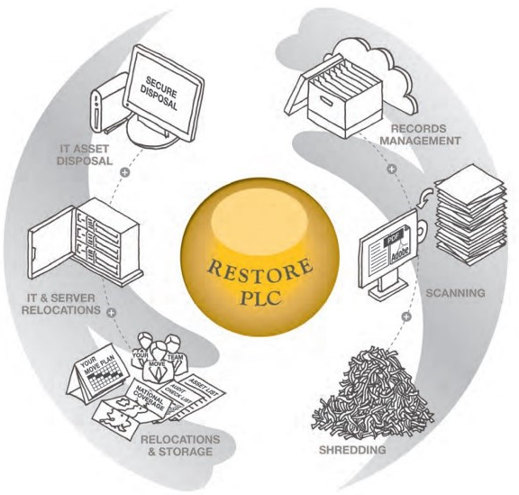

# restore-plc-thesis
Master’s thesis on the sectoral transformation of information &amp; records management services through emerging digital technologies, with a case study of Restore PLC. Includes original Turkish thesis, academic English translation, data, and figures.

# The Influence of Emerging Information Technologies on Sectoral Transformation: 
## A Case Study of Restore PLC

This repository contains all materials related to my master's thesis, originally written in Turkish and translated into fluent academic English.

**🎓 Author:**  
Uğur Arı  
İstanbul University, Institute of Social Sciences  
Department of Information and Records Management  
Supervisor: Prof. Dr. Niyazi Çiçek  
(Completed: 2025)

---

### 📚 Abstract
This study examines how Restore PLC, a UK-based information & records management group, leveraged emerging digital technologies to transform its sectoral positioning. It explores financial growth, mergers & acquisitions strategy, and the company's evolution from a traditional archiving service into a diversified digital ecosystem.

---

### 📁 Repository contents
- `docs/thesis_tr.pdf` → Original Turkish thesis
- `docs/thesis_en.md` → Academic-level English translation
- `docs/presentation.pdf` → Defense presentation slides
- `figures/` → Diagrams illustrating Restore PLC's ecosystem
- `data/` → Financial data and employment figures
- `translation-pipeline/` → Jupyter notebook + Python scripts used for translation

---

## 🌐 Restore PLC Ecosystem



> *Figure: The operational ecosystem of Restore PLC, illustrating its diversified service lines such as records management, secure disposal, IT asset relocations, scanning, and shredding.*


---

## 📖 How to cite this thesis

### APA (7th edition)
Arı, U. (2025). *The influence of emerging information technologies on sectoral transformation: A case study of Restore PLC* (Master’s thesis). Istanbul University, Institute of Social Sciences.

---

### Chicago (17th edition)
Arı, Uğur. 2025. *The Influence of Emerging Information Technologies on Sectoral Transformation: A Case Study of Restore PLC*. Master’s thesis, Istanbul University, Institute of Social Sciences.

---

### MLA (9th edition)
Arı, Uğur. *The Influence of Emerging Information Technologies on Sectoral Transformation: A Case Study of Restore PLC*. Master’s thesis, Istanbul University, Institute of Social Sciences, 2025.

---

### BibTeX
```bibtex
@thesis{ari2025restore,
  title={The Influence of Emerging Information Technologies on Sectoral Transformation: A Case Study of Restore PLC},
  author={Uğur Arı},
  school={Istanbul University, Institute of Social Sciences},
  year={2025},
  type={Master's Thesis}
}
```

# The Influence of Emerging Information Technologies on Sectoral Transformation:
## A Case Study of Restore PLC

[](http://creativecommons.org/licenses/by-nc-nd/4.0/)
[](https://doi.org/10.5281/zenodo.15768499)

---

### 📚 Abstract
This repository contains all materials related to my master's thesis...

